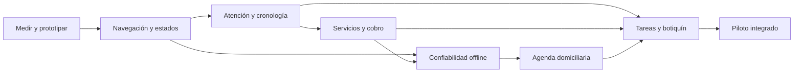

# Ideas y plan de evolución de Alma Veterinaria

Fecha de análisis: 16 de septiembre de 2026. Estado: propuesta para priorizar; no es una implementación ni autoriza integraciones o envíos externos.

## 1. Dirección de producto

Convertir Alma en una herramienta que permita preparar el día, llegar al domicilio, atender, cobrar y dejar seguimiento resuelto desde el teléfono. El criterio de éxito es cuánto trabajo administrativo queda pendiente después de la última visita.

Mantener Hoy, Agenda, Pacientes, Botiquín y Cobros. Los responsables conservan sus datos de contacto, domicilios y relación con los pacientes dentro del sistema profesional. No se propone volver a crear cuentas o portal para tutores.

Supuesto de planificación: profesional independiente o equipo pequeño que atiende domicilios en Chile. Volumen de visitas, distribución geográfica, dispositivos y necesidades de recepción deben medirse en el piloto; no se dispone de analítica de uso ni entrevistas que permitan cuantificar ahorro todavía.

## 2. Qué se revisó y límites

- Código actual de navegación, jornada, atención, agenda, ficha, inventario, cobros, permisos y almacenamiento local.
- Captura móvil de la prueba anterior con datos ficticios: sirve para revisar esa pantalla, no para afirmar que se auditó visualmente toda la aplicación actual.
- Sitios oficiales y documentación pública de cinco productos. Sus capacidades se describen como documentadas por el proveedor; no se realizaron pruebas de cuentas privadas ni se verificaron sus promesas comerciales de ahorro.
- Graphify no está disponible como ejecutable. Se intentó la consulta indicada y se continuó con lectura directa del código, sin depender de su grafo.

## 3. Referencias competitivas

| Producto | Capacidad publicada pertinente | Aplicación propuesta en Alma |
|---|---|---|
| [Shepherd](https://www.shepherd.vet/clinical-tools/automation/) | Conecta servicios realizados, cobro e indicaciones de alta; admite servicios agrupados. | Registrar cada prestación una vez y revisar sus efectos sobre cobro, consumo e indicaciones antes de confirmar. |
| [Digitail](https://help.digitail.io/en/articles/5998626-patient-timeline-overview) | Historial con citas, registros, tareas, seguimiento y comunicaciones; filtros y registros fijados para comparación. | Línea de tiempo del paciente y panel de antecedentes relevantes durante la visita. |
| [ezyVet](https://www.ezyvet.com/mobile) | Presenta trabajo veterinario móvil con captura clínica, facturación y sincronización después de recuperar cobertura. | Profundizar la preparación de jornada y la visibilidad del estado de guardado que ya tiene Alma. |
| [VetBadger](https://www.vetbadger.com/features/) | Tareas asignables, comunicación vinculada a la ficha, plantillas y zonas geográficas para agenda. | Pendientes con responsable y fecha, atajos de escritura y planificación por sectores. |
| [ThoroVet](https://www.thorovet.com/) | Producto especializado en veterinaria equina ambulante, con trabajo offline en iPad, cobros e historiales en terreno. | Tomar la especialización en terreno como referencia; su población equina y dependencia del iPad limitan la comparación con Alma. |

La oportunidad propuesta es reunir facilidad de uso móvil, funcionamiento con señal irregular y operación domiciliaria local. No se concluye que ningún competidor tenga exclusividad sobre estas funciones ni que todos carezcan de alguna capacidad no mencionada en sus páginas.

## 4. Base que ya existe y brechas concretas

| Área | Ya existe | Mejora pendiente |
|---|---|---|
| Jornada | Próxima visita, listado diario, saldos, tiempos y preparación offline. | Priorizar acciones, compactar mensajes y reunir pendientes del día anterior. |
| Navegación | Cinco áreas, menú lateral, búsqueda de pacientes y responsables. | Navegación inferior móvil; búsqueda con acciones y terminología consistente. |
| Atención | Nota, signos, fotos, insumos, cobro, cierre y resumen. | Formularios por tipo de atención y servicios estructurados ligados al cobro. |
| Paciente | Ficha y pestañas separadas para registros, citas, vacunas, recetas y laboratorio. | Cronología conjunta, alertas explícitas y evolución del peso. |
| Sin conexión | IndexedDB por cuenta, cola, idempotencia y shell público. | Centro de sincronización, cobertura descargada visible y compatibilidad entre versiones. |
| Agenda | Lista, calendario y controles de solapamiento. | Traslado, sectores, duración por servicio y domicilios compartidos. |
| Botiquín | Productos, consumo fraccionario, ubicaciones y transferencias. | Entrada al botiquín asignado al profesional, preparación diaria y lotes. |
| Cobros | Facturas por líneas en formulario general; cobro único en visita; pagos. | Unificar ambos recorridos sin duplicar consumos ni cobros. |

Hallazgos específicos que justifican la primera entrega:

1. `OnlineStatus.tsx` advierte que los cambios podrían no guardarse, mientras la visita informa que conserva borradores. Es necesario distinguir conexión, guardado local y confirmación del servidor.
2. El menú Botiquín abre `/inventario`, que muestra el listado general, aunque ya existe `/inventario/botiquin`. La entrada debe adaptarse al rol.
3. `Header.tsx` todavía muestra «tutores» y abre sus rutas históricas; se debe mantener la capacidad de buscar responsables y presentar sus pacientes, sin reintroducir una sección principal.
4. `AppointmentCalendar.tsx` usa horas del dispositivo; Hoy usa `America/Santiago`. Un dispositivo en otra zona puede mostrar horas diferentes.
5. La copia diaria aplica límites de visitas, productos y antecedentes, sin un manifiesto de cobertura. Debe indicar qué se descargó y si hay información adicional disponible en línea.
6. Algunas cargas de ficha e inventario convierten fallos en listas vacías. «No hay datos» y «No se pudo cargar» requieren estados distintos y reintento.
7. `VisitWorkspace.tsx` reúne interfaz, borrador, sincronización y cierre. Separar responsabilidades facilitará cambios sin perjudicar el guardado.

## 5. Ideas de frontend, por impacto

### A. Hoy como pantalla de trabajo

Primera pantalla móvil: visita en curso o siguiente visita, dirección, horario, acción principal y estado de guardado. Debajo, agenda compacta y pendientes accionables. Las métricas secundarias van después.

Unificar las notificaciones de preparación/sincronización en un solo bloque. El éxito transitorio puede desaparecer, pero los pendientes y errores deben seguir visibles. Una visita no debe perder su estado pendiente cuando el usuario navega.

Ejemplo de acción según contexto: «Salir hacia el domicilio», «Iniciar atención», «Continuar atención» o «Revisar cierre». Mantener siempre disponible abrir Maps y contactar al responsable.

### B. Navegación que se pueda usar con una mano

Barra inferior móvil con Hoy, Agenda, Pacientes, Botiquín y Cobros, filtrada por permisos. Configuración y perfil quedan en el menú de cuenta. En escritorio se conserva el lateral.

En atención, la barra de acciones tiene una ubicación estable y respeta el teclado y el área segura del teléfono. La navegación global y el botón de cierre no deben superponerse. Objetivo de diseño: controles táctiles de 44–48 px, texto de formularios de 16 px, etiquetas persistentes y foco visible; verificar contraste y zoom, sin afirmar cumplimiento hasta medirlo.

### C. Consulta corta cuando la consulta es corta

Plantillas de control, vacunación y consulta general con campos pertinentes. Secciones desplegables para fotos, insumos o exploración ampliada. Biblioteca de frases y preferencias por profesional.

Las plantillas contienen estructura y texto editable. No deben rellenar hallazgos normales, diagnósticos ni tratamientos como si se hubieran comprobado. «No registrado» sigue siendo diferente de «normal».

### D. Antecedentes siempre a mano

Cabecera compacta con paciente, especie, peso y fecha de medición; alertas registradas por el profesional y última atención. En escritorio, panel lateral; en móvil, panel desplegable sin perder el borrador.

Cronología con filtros para consulta, vacuna, examen, receta, documento y comunicación. Abrir el detalle conservando posición y filtros. Una gráfica de peso debe incluir fechas y omisiones, sin interpretar clínicamente las variaciones.

### E. Cobro legible y verificable

Mostrar prestaciones, cantidades, precio, traslado, ajustes autorizados, total, recibido y saldo. Usar los mismos componentes y cálculos en visita y facturación general. Diferenciar visualmente «prestación realizada», «cobro emitido» y «pago recibido».

### F. Identidad visual consistente

Mantener verde y superficies claras. Reducir bloques decorativos grandes en las pantallas de trabajo y usar el acento para la acción principal. Consolidar Button, Input, Select, estados, errores y tarjetas; evitar estilos manuales diferentes para el mismo control. Revisar modo oscuro, esqueletos de carga y formularios con error.

## 6. Ideas de funcionamiento

### 1. Prestación → nota, consumo, cobro e indicaciones

Catálogo de servicios y paquetes configurables. Seleccionar una prestación prepara sus líneas de cobro, posibles insumos e indicaciones. El veterinario confirma lo efectivamente realizado y puede ajustar cantidades. El servidor valida precio vigente o cotización aceptada, descuentos y existencias.

Guardar una selección en borrador no mueve stock ni emite un cobro. Un tratamiento solo debe provocar esos efectos una vez. La venta directa y la prestación clínica comparten reglas para evitar cobrar o descontar dos veces.

### 2. Pendientes y cierre del día

Bandeja de consultas por finalizar, resultados por revisar, seguimientos y cobros pendientes. Cada tarea tiene responsable, vencimiento, paciente y estado. Separar una tarea administrativa de una cita: cerrar una consulta puede dejar un pago pendiente sin convertir la atención en incompleta.

El cierre diario muestra lo resuelto, lo pendiente y la próxima acción. Los tiempos offline deben registrar la hora de realización y la de recepción por separado; el reloj del dispositivo no es una fuente infalible.

### 3. Agenda pensada para desplazamientos

Primero agregar sector, duración estimada y colchón de traslado manual. Después, domicilios guardados y orden de recorrido editable. Una integración de rutas sería una etapa posterior, con costo y proveedor evaluados en ese momento.

No mover citas confirmadas automáticamente. Proponer cambios, mostrar conflictos y solicitar una decisión del operador dentro del flujo. Un aviso por WhatsApp se prepara para revisión; abrir el enlace no equivale a haber enviado o entregado el mensaje.

### 4. Varias mascotas en un domicilio

Agrupar citas bajo una parada o visita domiciliaria, conservando registro clínico, estado y cobro por paciente. Permitir pasar a la siguiente mascota sin reescribir dirección y contacto. En la primera versión, un traslado se atribuye explícitamente a una sola cita; la facturación consolidada requiere otro diseño y queda fuera de esa entrega.

### 5. Botiquín listo antes de salir

Vista «Mi botiquín», faltantes respecto de mínimos y lista sugerida para las prestaciones planificadas. El inventario descargado es informativo hasta que el servidor confirme los consumos; no prometer reserva offline.

Una etapa posterior agrega lote, vencimiento por lote y ubicación, con trazabilidad de qué lote se usó. Los productos actuales sin lote deben migrar como existencia sin lote identificado, sin inventar vencimientos.

### 6. Seguimiento sin portal

Plantillas editables para confirmación, aviso de llegada, resumen y control. Asociar notas de comunicación a la ficha. Los recordatorios comienzan como tareas para el profesional; automatizar envíos requiere integración, configuración y reglas específicas posteriores.

### 7. Dictado como ayuda opcional

Evaluar después de las plantillas un dictado que genere texto editable. Si se incorpora un servicio de transcripción, definir consentimiento cuando corresponda al audio capturado, retención, proveedor, costos y revisión humana. No usar la propuesta para introducir decisiones clínicas automáticas. Disponibilidad offline y compatibilidad deben probarse en los dispositivos elegidos.

## 7. Plan de implementación

Tamaños relativos: S = acotado, M = varios componentes, L = varios flujos y cambios de datos. No son plazos contractuales. Cada fase debe liberarse y medirse antes de ampliar alcance.

| Fase | Entregable | Tamaño | Dependencia | Criterio de salida |
|---|---|---|---|---|
| 0 | Línea base y prototipo de Hoy/Atención/Cierre | S | Ninguna | Cinco recorridos observados, métricas iniciales y prototipo móvil revisado con usuarios. |
| 1 | Navegación, componentes y estados claros | M | 0 | Recorrido completo a 360/390 px, teclado y zoom sin acciones ocultas; horarios consistentes. |
| 2 | Plantillas, cabecera clínica y cronología | L | 1 | Consulta recuperable al navegar; cronología paginada y permisos verificados. |
| 3 | Servicios y cobro integrado | L | 1–2 | Una prestación produce un solo consumo/cobro; reversos y pagos parciales comprobados. |
| 4 | Centro de sincronización y preparación verificable | L | 1; protocolo de 3 definido | Cambio de versión, reintentos, sesión vencida y conflictos no pierden datos. |
| 5 | Agenda territorial y varias mascotas | L | 1 y 4 | Paradas coherentes, traslado visible, sin cambios silenciosos de horario ni mezcla clínica. |
| 6 | Seguimientos y preparación del botiquín | M/L | 2–5 | Tareas sin duplicados y faltantes calculados sobre existencias y planes identificados. |
| 7 | Piloto integrado y despliegue gradual | M | Cada entrega candidata | Evidencia de uso, regresiones resueltas y reversión ensayada. |

Las correcciones de claridad offline de fase 1 son inmediatas; no deben esperar al centro completo de fase 4. Lotes, rutas por proveedor y dictado quedan como ampliaciones separadas tras el piloto.

### Fase 0 — medir antes de ampliar

Observar crear una cita, encontrar antecedentes, atender con mala señal, cerrar/cobrar y recuperar un pendiente. Usar datos ficticios en las pruebas reproducibles. Registrar tiempo, abandonos, errores y pasos; no almacenar texto clínico ni nombres en analítica.

Definir el conjunto mínimo de servicios y tres plantillas con el veterinario. El prototipo debe cubrir vacío, carga, error, offline, pendiente y sincronizado. Revisar al menos teléfono Android y Safari/iPhone si ambos se utilizan.

### Fase 1 — experiencia base

Archivos principales: `DashboardShell.tsx`, `Sidebar.tsx`, `Header.tsx`, `DayPanel.tsx`, `OnlineStatus.tsx`, `AppointmentCalendar.tsx`, `permissions.ts`, `global.css` y componentes `ui/`.

Crear `MobileNavigation`, `SyncStatus`, `VisitStatusBadge`, `ErrorState` y acciones compartidas. Convertir el aviso de conexión en estado real de datos: local, enviando, confirmado o necesita revisión. Separar carga/preparación/sincronización para que cada botón muestre la acción correcta.

Corregir nomenclatura y destino de Botiquín por rol. Ampliar búsqueda a teléfono y responsable usando las capacidades existentes; controlar respuestas tardías, vacío y error. Mantener rutas antiguas durante la transición. Centralizar fecha/hora en `clinic-time.ts`.

Pruebas: teclado, foco al abrir/cerrar paneles, permiso de cada ruta, dispositivo en otra zona horaria, red disponible pero API caída, formularios con zoom y teclado móvil. Sin migración de negocio.

### Fase 2 — atención y memoria clínica

Separar `VisitWorkspace` en controlador de borrador/operaciones y vistas `VisitHeader`, `ClinicalNote`, `VisitHistory`, `SuppliesEditor`, `VisitCheckout` y resumen. Conservar UUID, cola y semántica del endpoint existente.

Datos nuevos propuestos: `clinical_templates` con versión y autor; `patient_alerts` con categoría, texto, autor y vigencia. Reutilizar `medical_records` y signos para el historial. Un endpoint paginado `GET /api/patients/:id/timeline` reúne las fuentes existentes con orden estable por fecha e identificador. Cada elemento se filtra por permisos en servidor.

Plantillas editables por tipo de atención; campos adicionales colapsados; nota breve y detallada como presentaciones del mismo registro. Las correcciones posteriores a cierre deben ser adendas trazables, con autor, fecha y referencia al original.

Pruebas: paginación sin duplicados, notas históricas intactas, alerta ausente frente a «sin alertas registradas», restricción de recepción, borradores con plantillas antiguas y reapertura tras navegación.

### Fase 3 — catálogo y cierre económico

Reutilizar productos e invoice_items. Agregar `services`, `service_components` y `visit_service_items` con identificador estable, referencia a cita, cantidades, estado de realización y fotografía de descripción/precio. Distinguir precio del servicio de su costo y del consumo de insumos.

Extender `VisitOperation` de manera versionada para líneas y cantidades. Mantener compatibilidad con `charge` de la primera versión mientras haya dispositivos con operaciones antiguas. El servidor resuelve catálogo, verifica autorización de ajustes y calcula importes con las utilidades monetarias existentes.

En `save-visit.ts`, mantener bloqueo, idempotencia y transacción; unir nota, prestaciones realizadas, consumo, líneas de cobro y pago. Definir referencias únicas entre prestación, movimiento y línea para que el formulario general y la visita reconozcan lo ya contabilizado. Una corrección genera movimiento compensatorio y registro de auditoría, no un borrado del historial.

La pantalla presenta propuesta editable y confirmación antes de aplicar efectos. Un cambio de tarifa posterior no modifica una atención histórica. Si una tarifa descargada quedó obsoleta, mostrar diferencia y aplicar la política definida, sin cobro silencioso.

Pruebas PostgreSQL reales: solicitudes simultáneas, replay tras respuesta perdida, pago parcial, múltiples líneas, paquete, stock fraccionario, producto inactivo, saldo modificado y convivencia con factura general. Aclarar en interfaz qué documento interno emite Alma; cualquier integración tributaria es otro proyecto.

### Fase 4 — confiabilidad de terreno

Versionar payload de operación, borrador y snapshot. Agregar metadatos de cobertura por visita, fechas de descarga, catálogos y antecedentes incluidos. Descargar antecedentes por paciente de forma acotada y verificable; la truncación nunca debe parecer historial completo.

Centro de sincronización con operación, paciente, antigüedad, último intento y acción recuperable. Distinguir fallo transitorio, sesión vencida, rechazo confirmado y resultado incierto. Si se desconoce si el servidor aplicó algo, reenviar el UUID original antes de permitir descartarlo o crear una operación sustituta.

Agregar coordinación entre pestañas, actualización segura del service worker y retención limitada de snapshots antiguos sin eliminar operaciones pendientes. Mantener separado shell público de datos privados. Solicitar persistencia de almacenamiento cuando el navegador la permita y explicar su alcance; ningún navegador garantiza conservación absoluta.

Registrar `occurredAt`, `receivedAt` y secuencia para eventos de trabajo. Los tiempos del cliente se marcan como tales y se comprueban; no ordenan por sí solos decisiones financieras o de inventario. La aplicación continúa sincronizando al estar abierta: no prometer ejecución en segundo plano si el navegador la cierra.

Pruebas: corte tras commit antes de respuesta, cambio de usuario, pestañas simultáneas, cuota agotada, actualización con cola antigua, reloj desajustado y revocación de asignación de una visita.

### Fase 5 — logística domiciliaria

Datos propuestos: `visit_addresses` con dirección, indicaciones de acceso y sector; `route_days` y `route_stops` con profesional, fecha y orden; `appointments.route_stop_id` opcional. Conservar la dirección efectiva de la cita como snapshot para no alterar visitas pasadas al editar un domicilio.

Primera entrega con sectores y traslado manual, reordenación accesible y validación de solapamientos. Agrupar pacientes seleccionados bajo una parada explícita; no asumir que igual apellido implica igual domicilio. El alta de parada/citas debe ser transaccional.

Registrar consulta y cobro por mascota. El traslado se atribuye a una sola cita del grupo y queda visible; cambios y cancelaciones requieren resolver su atribución. No repartir automáticamente cobros entre responsables diferentes.

La geocodificación y cálculo de trayectos se aíslan detrás de un proveedor intercambiable; revisión de cobertura, costos y datos enviados antes de elegirlo. La agenda debe seguir funcionando si el proveedor falla. No requiere seguimiento permanente de ubicación.

### Fase 6 — tareas y botiquín

Agregar `followup_tasks` con paciente/cita, responsable, vencimiento, estado y clave de origen única; `communication_events` con canal y resultado declarado. Crear tareas derivadas de prestaciones en la misma transacción o con una cola de eventos persistente y deduplicada.

Estados de comunicación: preparado, declarado enviado manualmente y, solo si una integración lo acredita, entregado. Un enlace abierto no cambia una tarea a completada automáticamente. No enviar mensajes reales durante pruebas.

Calcular faltantes del botiquín usando las prestaciones planificadas y existencias de su ubicación. Separar recomendado, disponible y pendiente de sincronizar. Las transferencias siguen siendo confirmadas en servidor.

Para lotes posteriores: `product_lots` y existencias por lote/ubicación, reconciliación con el total actual y migración de datos no identificados. Ensayar el balance de cantidades antes de activar validaciones de lote; no mantener dos fuentes de stock modificables sin conciliación.

### Fase 7 — validación y entrega

Crear entorno PostgreSQL de prueba separado. Migraciones aditivas y reversión de aplicación mediante banderas de función; no borrar tablas nuevas para desactivar una interfaz. Probar datos anteriores a cada migración.

Mantener los tests existentes y ampliar contratos, transacciones y navegador. Ejecutar `npm test`, `npx astro check` y `npm run build`, además de pruebas integradas de base y teléfonos objetivo. La cola de una versión anterior debe procesarse en la nueva.

Piloto con un profesional durante varias jornadas y ampliación por rol. Antes del despliegue, revisar operaciones pendientes y compatibilidad del cliente descargado. Vigilar fallos de cierre, duplicados, desfases de stock y demoras de sincronización con identificadores técnicos sin contenido clínico.

## 8. Dependencias y orden recomendado

Cada fase incluye su propia prueba y piloto acotado. El diagrama expresa dependencias de integración, no obliga a esperar al final para entregar mejoras utilizables.

## 9. Métricas y aceptación del producto

| Medida | Cómo obtenerla | Uso |
|---|---|---|
| Tiempo administrativo por visita | Tiempo activo de interacción y observación, separado del tiempo clínico | Comparar plantillas y cierre contra línea base. |
| Consultas pendientes al terminar la jornada | Consultas iniciadas sin cierre, excluidas cancelaciones | Medir si se reduce trabajo posterior. |
| Cobros corregidos por omisiones | Motivo de ajuste registrado | Evaluar catálogo sin confundirlo con cambios clínicos legítimos. |
| Sincronización exitosa y antigüedad de pendientes | Eventos técnicos por operación | Detectar fallos y acumulación. |
| Faltantes de botiquín | Incidencias por jornada y producto | Evaluar preparación diaria. |
| Seguimientos vencidos | Tareas abiertas pasada su fecha | Mejorar continuidad operativa. |

Fijar metas numéricas después de obtener la línea base. Criterios obligatorios: cero duplicados en pruebas de reintento, ningún éxito aparente cuando falló el guardado, permisos consistentes y conservación de borradores en los escenarios de recuperación ensayados.

## 10. Qué pospondría

Portal de tutores, aplicación nativa, optimización automática compleja de rutas, IA diagnóstica, dashboards extensos y automatización masiva de mensajes. Antes invertiría en consistencia móvil, catálogo/prestaciones, sincronización y pendientes.

Mi primera entrega sería la fase 1 junto con un prototipo de plantillas y cierre. Es la forma de mejorar la experiencia visible y validar el siguiente cambio de datos sin rehacer la base que ya funciona.
